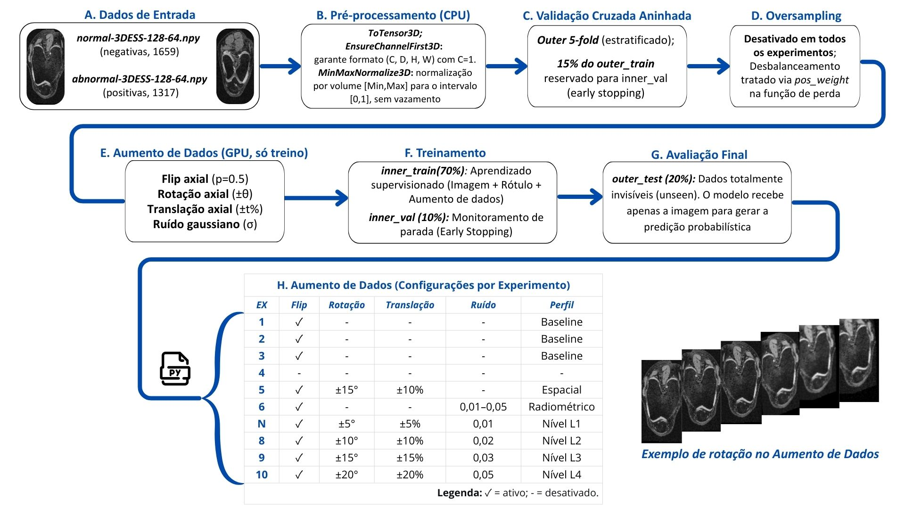

# Knee MRI Augmentation (SBCAS 2026)

[](LICENSE)


Avaliação de Técnicas de Aumento de Dados para Classificação Binária de Imagens volumétricas de Ressonância Magnética do Joelho.

---

## Pipeline experimental

**Figura 1.** Validação cruzada estratificada 5-fold (20% *outer_test*), com *inner_val* (15% do *outer_train*) dedicado ao *early stopping*. Aumento aplicado apenas no treino e teste final em dados originais. *Oversampling* desativado em todos os experimentos; desbalanceamento tratado via `pos_weight` na função de perda. Fonte: elaboração própria.


---

## Artigo (SBCAS 2026)

**Título:** *Avaliação de Técnicas de Aumento de Dados para Classificação Binária de Imagens volumétricas de Ressonância Magnética do Joelho*

**Autores:**
- Thalles Cotta Fontainha (CEFET/RJ)
- Felipe da R. Henriques (CEFET/RJ)
- Amaro A. Lima (CEFET/RJ)
- Gabriel M. Araujo (CEFET/RJ)
- Ricardo de S. Tesch (UNIFASE)

**Afiliações (como no artigo):**
- Programa de Pós-Graduação em Instrumentação e Óptica Aplicada — CEFET/RJ  
- Programa de Pós-Graduação em Ciência da Computação — CEFET/RJ  
- Departamento de Telecomunicações — CEFET/RJ (Campus Nova Iguaçu)  
- Programa de Pós-Graduação em Engenharia Elétrica — CEFET/RJ  
- Departamento de Medicina Regenerativa — UNIFASE  

---

## Resumo

A osteoartrite do joelho é prevalente, causando dor e perda funcional. Este estudo avalia aumento de dados para classificação binária de RM volumétrica do joelho (sequência 3D DESS) com o modelo R3D-18. Foram realizados dez experimentos (EX1--EX10) com validação cruzada estratificada (5 folds), aplicando aumento apenas no treino. Comparam-se transfer learning, Automatic Mixed Precision (AMP) e transformações espaciais/radiométricas. A inicialização pré-treinada (EX1 vs. EX2) teve o maior efeito. A ablação de AMP (EX3) exigiu ajustes por limitação de VRAM, evidenciando viabilidade computacional, não uma comparação controlada de desempenho. O pico de AUC foi cerca de 0,90 em EX8 e EX10.


---

## Principais inovações

- **Nested Cross-Validation (protocolo sem vazamento):**
  - Divisão em **outer_train (80%)** e **outer_test (20%)**;
  - Dentro do **outer_train**, um **inner_split (15% do treino)** é reservado **exclusivamente** para **early stopping**.
- **Aumento de dados na GPU:**
  - Transformações **espaciais** e **radiométricas** aplicadas diretamente na **GPU** durante o loop de treino (via `grid_sample`);
  - Reduz gargalos de CPU e melhora o fluxo de treino (incluindo uso/gestão de VRAM conforme o pipeline).
- **Consistência metodológica (controle de variáveis):**
  - **Oversampling desativado** em todos os experimentos (`oversample=False`);
  - Desbalanceamento tratado **apenas** via ponderação da função de perda (**`pos_weight`**), evitando variáveis de confusão.

---

## Catálogo de experimentos (EX1 a EX10)

O projeto consiste em **10 cenários controlados**, cada um definido por um script modular:

1. **EX1 (Baseline 2.0):** R3D-18 **pré-treinado** (Kinetics-400), **AMP ativo** e **apenas flip axial**.  
2. **EX2 (Ablação TL):** treinamento **do zero** (inicialização aleatória) para medir o impacto de **transfer learning**.  
3. **EX3 (Ablação AMP):** treinamento em **precisão total (FP32)**.  
   - Exige redução de `batch_size` (**32 → 2**) para evitar erro de memória.
4. **EX4 (Ablação Aug):** remoção total do aumento de dados, mantendo apenas **normalização min-max por volume**.  
5. **EX5 (Espacial):** transformações geométricas (**rotação axial ±15°** e **translação ±10%**).  
6. **EX6 (Radiométrico):** transformações de intensidade (**ruído gaussiano**, **contraste** e **correção gama**).  
7. **EX7 (Sweep L1):** varredura de intensidade — **nível leve**  
   - Rotação **±5°**, Translação **±5%**, Ruído **0,01**.
8. **EX8 (Sweep L2):** varredura de intensidade — **nível moderado**  
   - Rotação **±10°**, Translação **±10%**, Ruído **0,02**.
9. **EX9 (Sweep L3):** varredura de intensidade — **nível forte**  
   - Rotação **±15°**, Translação **±15%**, Ruído **0,03**.
10. **EX10 (Sweep L4):** varredura de intensidade — **nível muito forte**  
   - Rotação **±20°**, Translação **±20%**, Ruído **0,05**.

---

## Dados e requisitos

### Dataset

O pipeline assume que os arquivos abaixo estão em:

```bash
~/dataset/OAI-MRI-3DDESS/
```

Arquivos esperados:
- `normal-3DESS-128-64.npy`
- `abnormal-3DESS-128-64.npy`

> Observação: os dados **não** estão incluídos no repositório (tamanho/licença).  
> Se você usa outro caminho/nome, ajuste a configuração (via `ExperimentConfig`).

---

## Ambiente (DEEP-02 / LASAI)

- **Hardware:** 2× NVIDIA GeForce RTX 2080 Ti (12 GB cada)  
- **Software:** Python 3.10.19, PyTorch 2.0.1, CUDA 11.8


---

## Execução

Todos os experimentos utilizam a classe centralizada `ExperimentConfig`.  
Para rodar um experimento e garantir auditoria (logs + snapshot do código):

```bash
# Exemplo: rodar o Baseline 2.0
CUDA_VISIBLE_DEVICES=0,1 python EX1.py
```

---

## Artefatos gerados por fold

Cada execução gera uma pasta de resultados contendo:

- `y_true.npy` e `y_prob.npy`: rótulos e predições para reconstrução da curva ROC;
- `best_inner.pth`: checkpoint do modelo selecionado pelo **early stopping**;
- `summary.json`: agregado das métricas (AUC, Acurácia, F1) após os **5 folds**.

---

## Autor correspondente

**Thalles Cotta Fontainha** — `thalles.fontainha@aluno.cefet-rj.br`
